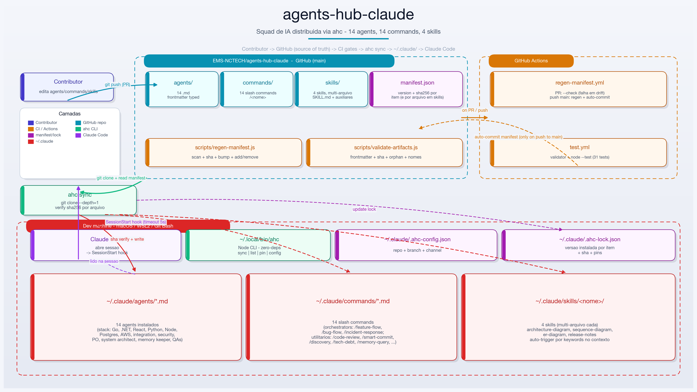

# agents-hub-claude

> 📘 **[Guia de uso com exemplos →](docs/USAGE.md)** — o que cada agent/command faz, quando acionar, prompts prontos e fluxos combinados.
> 🗺️ **[Roadmap →](docs/ROADMAP.md)** — iniciativas futuras, decisões pendentes e o que está fora de escopo (com razão).

## Objetivo

Padronizar e distribuir, de forma automática, o time de **agents e slash commands do Claude Code** usados pela engenharia da EMS-NCTECH. O hub existe para que:

- **Todo dev tenha o mesmo ferramental** — os mesmos agents (Go, .NET, React, DBA, DevOps, Arquitetura, PO, QA…) e os mesmos commands (`/code-review`, `/smart-commit`, `/discovery`, `/arch-design`, etc.) instalados, versionados e atualizados sem esforço manual.
- **As boas práticas virem código** — convenções, checklists de review, templates de ADR e fluxos de discovery ficam versionados no repo, não em wikis esquecidas.
- **A curva de onboarding caia** — um dev novo roda `install.sh` uma vez e passa a ter o mesmo "time sênior virtual" que o resto da engenharia já usa no dia a dia.
- **As atualizações cheguem sozinhas** — o hook `SessionStart` roda `ahc sync` a cada sessão, então melhorias feitas aqui chegam a todos na próxima vez que abrirem o Claude Code, sem ninguém precisar lembrar de dar pull.
- **Haja uma fonte única da verdade** — `manifest.json` com versão + `sha256` por item, garantindo integridade e rastreabilidade das mudanças.

Em resumo: **menos tempo configurando Claude Code, mais tempo entregando software com qualidade consistente entre squads.**

---

## Arquitetura



> Gerado pela skill `architecture-diagram` (matplotlib). Pra regenerar após mudar a estrutura: `python3 docs/architecture/render.py`.

**Fluxo, da esquerda pra direita:**

1. **Contributor** edita `agents/`, `commands/` ou `skills/` no repo do hub.
2. Push pra um PR → **CI Actions** roda dois gates: `regen-manifest --check` (falha se manifest está desatualizado) + `test.yml` (validator + 31 testes de integração `node:test`).
3. Merge no `main` → workflow `regen-manifest` faz auto-commit do manifest se houver drift residual.
4. Em cada `SessionStart` do Claude Code de cada dev, o hook dispara `ahc sync --quiet --timeout=5`.
5. `ahc` faz `git clone --depth=1` do repo, lê `manifest.json`, compara com `~/.claude/.ahc-lock.json`, baixa só o que mudou, **verifica sha256 por arquivo** (incluindo cada arquivo dentro de uma skill), grava em `~/.claude/{agents,commands,skills}/`.
6. Claude Code lê `~/.claude/` na inicialização da sessão; agents/commands/skills ficam disponíveis pro dev imediatamente.

---

Registry centralizado de **agents, commands e skills do Claude Code** da EMS-NCTECH, com CLI própria (`ahc`) que sincroniza tudo automaticamente em cada máquina.

- **Fonte da verdade:** `manifest.json` com versão e `sha256` por item (e por arquivo, em skills)
- **CLI:** `ahc` — Node zero-deps, distribuída via `install.sh`
- **Auto-update:** hook `SessionStart` do Claude Code roda `ahc sync` a cada sessão
- **Destino dos arquivos:** `~/.claude/agents/` (agents), `~/.claude/commands/` (slash commands), `~/.claude/skills/<nome>/` (skills multi-arquivo)
- **Quality gates:** GitHub Actions `regen-manifest` (PR + push) e `test.yml` (validator + 31 testes)

> **Como usar cada agent/command?** Veja o **[Guia de uso com exemplos →](docs/USAGE.md)** — o que cada um faz, quando acionar, prompts prontos e fluxos combinados.

---

## Instalação

O repo é `INTERNAL` na org EMS-NCTECH, então o `ahc` usa `git clone` sob o capô (com as suas credenciais do GitHub) em vez de HTTP anônimo. Requisitos comuns:

- **`git`** — autenticado na org EMS-NCTECH
- **`node`** (v18+) — o `ahc` CLI é Node puro, zero-deps
- **`gh` CLI** — recomendado pra autenticação automática (alternativa: PAT no keychain)

### macOS

**1) Instalar pré-requisitos (se não tiver):**

```bash
brew install git node gh
```

**2) Autenticar no GitHub:**

```bash
gh auth login
```

Escolha: GitHub.com → HTTPS → "Login with a web browser" → siga o fluxo. Isso configura o git credential helper automaticamente pra clonar repos privados/internal.

**3) Instalar o hub:**

```bash
cd /tmp
gh repo clone EMS-NCTECH/agents-hub-claude ahc-boot
bash ahc-boot/install.sh
rm -rf ahc-boot
```

**4) Garantir que `~/.local/bin` está no PATH.** Adiciona ao seu `~/.zshrc` (ou `~/.bash_profile`):

```bash
export PATH="$HOME/.local/bin:$PATH"
```

Depois recarrega: `source ~/.zshrc`.

**5) Verificar:**

```bash
ahc list
```

Deve listar os 18 agents + 14 commands + 4 skills com status `local:X.Y.Z   remote:X.Y.Z`.

---

### Windows

O `install.sh` precisa de um shell bash. No Windows, a forma recomendada é **WSL2** (Ubuntu). Git Bash também funciona com pequenos ajustes.

#### Opção A — WSL2 (recomendada)

**1) Instalar WSL2 + Ubuntu** (no PowerShell como admin):

```powershell
wsl --install -d Ubuntu
```

Reinicia o Windows, abre o Ubuntu pelo menu Iniciar, cria seu usuário.

**2) Dentro do Ubuntu (WSL), instalar pré-requisitos:**

```bash
sudo apt update && sudo apt install -y git curl
curl -fsSL https://deb.nodesource.com/setup_20.x | sudo -E bash -
sudo apt install -y nodejs
curl -fsSL https://cli.github.com/packages/githubcli-archive-keyring.gpg | sudo dd of=/usr/share/keyrings/githubcli-archive-keyring.gpg
sudo chmod go+r /usr/share/keyrings/githubcli-archive-keyring.gpg
echo "deb [arch=$(dpkg --print-architecture) signed-by=/usr/share/keyrings/githubcli-archive-keyring.gpg] https://cli.github.com/packages stable main" | sudo tee /etc/apt/sources.list.d/github-cli.list
sudo apt update && sudo apt install -y gh
```

**3) Autenticar no GitHub:**

```bash
gh auth login
```

**4) Instalar o hub:**

```bash
cd /tmp
gh repo clone EMS-NCTECH/agents-hub-claude ahc-boot
bash ahc-boot/install.sh
rm -rf ahc-boot
```

**5) PATH (WSL bash):**

```bash
echo 'export PATH="$HOME/.local/bin:$PATH"' >> ~/.bashrc
source ~/.bashrc
```

**6) Verificar:**

```bash
ahc list
```

> **Importante:** o Claude Code no Windows lê `~/.claude/` a partir do filesystem onde ele roda. Se você usa Claude Code **nativo no Windows**, ele lê `C:\Users\<você>\.claude\` — e o install feito dentro do WSL instala em `/home/<você>/.claude/` (que é outro lugar). Veja a **Opção B** abaixo pra essa situação.

#### Opção B — Git Bash (Claude Code nativo no Windows)

Use quando você roda o Claude Code no Windows (não dentro do WSL).

**1) Instalar pré-requisitos:**
- [Git for Windows](https://git-scm.com/download/win) (vem com Git Bash)
- [Node.js LTS](https://nodejs.org/) (v18+)
- [GitHub CLI](https://cli.github.com/)

**2) Abrir o Git Bash** (não PowerShell nem cmd) e autenticar:

```bash
gh auth login
```

**3) Instalar o hub:**

```bash
cd /tmp
gh repo clone EMS-NCTECH/agents-hub-claude ahc-boot
bash ahc-boot/install.sh
rm -rf ahc-boot
```

O `install.sh` vai detectar `$HOME` como `C:\Users\<você>` no Git Bash e instalar em:
- CLI: `C:\Users\<você>\.local\bin\ahc`
- Agents: `C:\Users\<você>\.claude\agents\`
- Commands: `C:\Users\<você>\.claude\commands\`
- Cache: `C:\Users\<você>\.claude\.ahc-cache\`

**4) Adicionar `~/.local/bin` ao PATH do Windows** (necessário pro Claude Code achar o `ahc` ao disparar o hook):

- Abre **Configurações do Windows** → busca "variáveis de ambiente" → "Editar as variáveis de ambiente do sistema"
- Em **Variáveis de Ambiente** → **Path** (usuário) → Editar → Novo
- Adiciona: `%USERPROFILE%\.local\bin`
- OK. Fecha e reabre o Git Bash / Claude Code.

**5) Verificar:**

```bash
ahc list
```

---

### Solução de problemas

**`fatal: could not read Username for 'https://github.com'`**
Git não tem credenciais. Rode `gh auth login` e tente de novo. Se já tiver rodado, force o credential helper: `gh auth setup-git`.

**`ahc: command not found` depois do install**
`~/.local/bin` não está no PATH. Veja os passos de PATH por plataforma acima.

**`ahc sync` funciona manual, mas auto-update não roda ao abrir o Claude Code**
O hook `SessionStart` não está no `settings.json`. Confirme com:
```bash
grep -c 'ahc sync' ~/.claude/settings.json
```
Se retornar `0`, re-rode o `install.sh` — ele faz merge seguro no settings.json existente.

**Claude Code no Windows não encontra o `ahc` ao disparar o hook**
O PATH do Claude Code (processo gráfico) não herda alterações feitas no Git Bash. Configure `%USERPROFILE%\.local\bin` no PATH via Configurações do Windows (passo 4 da Opção B) e reabra o Claude Code.

**`node: command not found`**
Instala Node.js LTS (v18+). Mac: `brew install node`. Windows: [nodejs.org](https://nodejs.org/). WSL: ver passo 2 da Opção A.

---

## Como usar

### Sincronizar agents

```bash
ahc sync                # baixa o manifest, atualiza o que mudou
ahc sync --quiet        # sem logs (usado pelo hook SessionStart)
ahc sync --force        # ignora pins, força atualização
```

O `sync` é idempotente: só baixa o agent se o `sha256` do manifest diferir do `~/.claude/.ahc-lock.json` local. Se você estiver offline, falha silenciosamente e mantém o cache local.

### Listar estado atual

```bash
ahc list
```

Mostra cada agent com versão local vs remota. Legenda:

- `++` novo (disponível remoto, não instalado)
- `↑↑` atualização disponível
- `--` removido remotamente (ainda presente local)

### Travar uma versão (pin)

```bash
ahc pin arquiteto-sr@1.2.0     # não atualiza esse agent
ahc unpin arquiteto-sr         # volta a atualizar
```

Útil quando um agent novo quebra seu fluxo e você quer segurar a versão antiga até investigar.

### Configuração

```bash
ahc config                                        # mostra config atual
ahc config repo=EMS-NCTECH/agents-hub-claude      # muda o repo fonte
ahc config branch=beta                            # troca pro canal beta
ahc config channel=beta                           # label do canal
```

Config fica em `~/.claude/.ahc-config.json`.

---

## Auto-update via SessionStart

Já configurado pelo `install.sh` em `~/.claude/settings.json`:

```json
{
  "hooks": {
    "SessionStart": [
      {
        "matcher": "*",
        "hooks": [
          { "type": "command", "command": "/home/you/.local/bin/ahc sync --quiet --timeout=3" }
        ]
      }
    ]
  }
}
```

Toda vez que você abre o Claude Code, o hook roda o sync em background com timeout de 3s. Se estiver offline, não bloqueia a sessão.

---

## Agents disponíveis

Lista atual agrupada por **time** (ver `manifest.json` para versões e hashes). Cada agent declara seu time na frontmatter (`team: <bucket>`) — a CLI usa isso pra agrupar `ahc list` e o validator garante o enum.

### backend
| Agent | Uso |
|---|---|
| `dotnet-backend-architect` | .NET / ASP.NET Core / DDD / CQRS |
| `go-senior-engineer` | Go senior — concurrency, gRPC, microservices |
| `nodejs-backend-architect` | Node.js TS-first — Fastify/Express/NestJS, Prisma/Drizzle, Zod |
| `python-engineer` | Python idiomático — FastAPI/Django, Pydantic v2, async, pytest, polars |

### frontend
| Agent | Uso |
|---|---|
| `senior-react-developer` | React, hooks, state, acessibilidade, testes |

### data
| Agent | Uso |
|---|---|
| `cache-search-engineer` | Cache (Redis/Memcached/ElastiCache) e search (Elasticsearch/OpenSearch) — patterns, invalidação, stampede, relevância, mapping/sharding |
| `postgres-dba` | PostgreSQL DBA — tuning, replicação, HA, troubleshooting |

### devops
| Agent | Uso |
|---|---|
| `aws-devops-engineer` | Infra AWS, CI/CD, Terraform, EKS, observabilidade |
| `infra-cost-estimator` | Estimativa de custo de infra, TCO, comparação de cenários, FinOps, build-vs-buy com sensibilidade |

### integration
| Agent | Uso |
|---|---|
| `integration-architect` | Event-driven, SQS/SNS/Kafka, CDC, orchestration |

### architecture
| Agent | Uso |
|---|---|
| `system-architect` | Arquitetura, ADRs, C4, análise de trade-offs |

### security
| Agent | Uso |
|---|---|
| `security-specialist` | AppSec/DevSecOps — OWASP Top 10, CWE Top 25, STRIDE, release-gate |

### qa
| Agent | Uso |
|---|---|
| `cypress-qa-analyst` | Cypress E2E, estratégia de teste, CI integration |
| `go-sdet-backend` | Go SDET — testes, coverage, race, fuzz |

### product
| Agent | Uso |
|---|---|
| `senior-product-designer` | UX strategy — discovery, IA, journey, heurísticas, a11y, design system |
| `senior-product-owner` | User stories, OKRs, priorização de backlog |

### docs
| Agent | Uso |
|---|---|
| `technical-writer` | Documentação user-facing — Diátaxis, getting-started, tutorials, how-tos, migration guides |

### meta
| Agent | Uso |
|---|---|
| `project-memory-keeper` | Trio `.claude/memory/{business,architecture,guidelines}.md` + READMEs + ADRs |

> Para listar localmente filtrando por time: `ahc list --team=backend,data`.

## Commands disponíveis

Slash commands instalados em `~/.claude/commands/` — invoque com `/<nome>`:

| Command | Uso |
|---|---|
| `/api-contract` | Gerar OpenAPI spec ou validar contratos entre serviços |
| `/arch-design` | Design arquitetural — diagramas C4, ADRs, análise de trade-offs |
| `/bootstrap-project` | Escaneia o repo, detecta stack e cria `.claude/memory/{business,architecture,guidelines}.md` + `docs/{adr,todo,done}/` |
| `/bug-flow` | Orquestração de bug: triage → RCA → fix + teste de regressão → security gate → commit |
| `/code-review` | Revisão de PR ou diff — security, correctness, performance, testing |
| `/db-audit` | Auditoria de schema, índices, FKs, migrations, queries e segurança de banco |
| `/discovery` | Product discovery — problem framing, JTBD, assumptions, experimentos, go/no-go |
| `/feature-flow` | Orquestração de feature: PO → Arquiteto → (Threat-model) → Dev → QA → Security gate → Review → Commit |
| `/incident-response` | Orquestração de incidente em prod: detect → triage → mitigate → RCA → fix → postmortem blameless |
| `/jira-story` | Redigir ou refinar user stories com critérios de aceite e cenários de teste |
| `/memory-query` | Lookup de alta precisão na memória do projeto (`.claude/memory/*`) com citação do arquivo + seção |
| `/onboard-dev` | Gerar `ONBOARDING.md` completo pra novos devs do projeto |
| `/smart-commit` | Analisar diff e criar Conventional Commit com type/scope corretos |
| `/tech-debt` | Escanear e classificar dívida técnica com plano de ação priorizado |

> Detalhes, exemplos de prompt e fluxos combinados: **[docs/USAGE.md](docs/USAGE.md)**.

---

## Adicionando / atualizando um agent, command ou skill

1. **Crie ou edite** o arquivo:
   - `agents/<nome>.md` — agent
   - `commands/<nome>.md` — slash command
   - `skills/<nome>/SKILL.md` (+ qualquer arquivo auxiliar em subpastas) — skill multi-arquivo
2. **Regenere o manifest** localmente:
   ```bash
   node scripts/regen-manifest.js
   ```
   O script escaneia `agents/` + `commands/` + `skills/`, recalcula sha256 (por arquivo nas skills), bumpa `version` (patch por padrão; use `--bump=minor` ou `--bump=major` quando aplicável), atualiza `updated_at`, e lida com adição/remoção de itens.
3. **Edite a `description`** do item no `manifest.json` se for um arquivo novo (a auto-extração tira da frontmatter, mas vale revisar).
4. **Commit + PR** para `main`.

A GitHub Action **Regen manifest** roda em PRs com `--check` (falha se a pessoa esqueceu o passo 2) e roda automaticamente no push pra `main` (auto-commit do manifest se houver drift residual).

Assim que o PR for mergeado, todos os devs com `ahc` instalado vão receber a atualização no próximo `SessionStart`.

### Modos do script

```bash
node scripts/regen-manifest.js                # default: bump patch nos que mudaram, escreve manifest
node scripts/regen-manifest.js --dry-run      # mostra o que mudaria, sem escrever
node scripts/regen-manifest.js --check        # exit 1 se manifest está desatualizado (modo CI)
node scripts/regen-manifest.js --bump=minor   # bump minor em todos que mudaram
node scripts/regen-manifest.js --bump=major   # bump major em todos que mudaram
```

---

## Validação e testes

Dois mecanismos rodam em CI (workflow `Test`) em todo PR e push pra `main`. Ambos são zero-dep e dá pra rodar local antes do commit.

### Validator de artefatos

`scripts/validate-artifacts.js` cobre o que o `regen-manifest.js` não cobre — invariantes do conteúdo:

- Frontmatter obrigatório nos agents (`name`, `description`, `model`).
- `name` da frontmatter bate com o nome do arquivo (kebab-case).
- `description` (quando entre aspas) é JSON válido.
- `model` em `opus|sonnet|haiku`.
- `tier` (quando presente) em `reasoning|speed`.
- `team` (quando presente) em `backend|frontend|data|devops|integration|architecture|security|qa|product|docs|meta`.
- Skills: `SKILL.md` existe, frontmatter tem `name` igual à pasta, manifest tem todos os arquivos da árvore (sem orphan).
- `manifest.updated_at` no formato `YYYY-MM-DD`.
- `sha256` de cada item bate com o conteúdo do arquivo.

```bash
node scripts/validate-artifacts.js                  # passa com warnings, exit 0 se sem erros
node scripts/validate-artifacts.js --quiet          # só erros
node scripts/validate-artifacts.js --strict         # tier e team ausentes viram erro (não warning)
```

### Testes (`node --test`)

Suite de integração cobrindo o CLI (`bin/ahc`), o regen (`scripts/regen-manifest.js`) e o validator. Spawna o CLI real contra fixtures `file://` num `HOME` temporário — testa exatamente o que o dev experimenta.

```bash
node --test test/*.test.js                          # roda tudo (~1.5s)
node --test test/sync.test.js                       # só os de sync
node --test test/regen.test.js                      # só regen
node --test test/validator.test.js                  # só validator
```

Cobertura atual:

- `sync.test.js` — install fresco, idempotência, hash mismatch em skill, pin/unpin, lock back-compat (sem `skills` field), `list` com 3 categorias, `config` get/set.
- `regen.test.js` — clean repo, edição com bump patch, `--check` falhando em drift, `--dry-run`, novo agent, remoção de orphan, skill multi-arquivo, `.DS_Store` ignorado, `--bump=minor`, `--bump` inválido.
- `validator.test.js` — fixture clean passa, frontmatter ausente, name/filename mismatch, JSON quebrado, model/tier inválidos, `--strict`, sha drift, file ausente, orphan, aux file fora do manifest, manifest JSON inválido, `updated_at` formato errado.

---

## Convenções de redação (agents & commands)

Para manter o hub coerente, todo agent ou command novo segue:

### Idioma

- **Agent-facing (instruções pro modelo) → inglês.** O corpo do `.md` que descreve missão, princípios, workflow, regras, anti-patterns e protocolo de colaboração é sempre em inglês. Modelos respondem melhor a prompts em inglês e o vocabulário técnico (BLOCKER, OWASP, CWE, ADR, etc.) já é inglês.
- **User-facing (output que o usuário lê / textos que o agent fala de volta) → português.** Mensagens, perguntas, exemplos de prompt no `description`, templates de relatório que o agent vai exibir pro dev brasileiro — em PT-BR.
- **Docs do hub (`README.md`, `docs/USAGE.md`) → português.** Audiência são os devs da EMS-NCTECH.

> Status: todos os commands seguem essa regra hoje (sweep PT-BR concluído em 2026-05-02). Termos técnicos (BLOCKER, WARNING, CRITICAL, OWASP, ADR, JTBD, INVEST, sync, push) ficam em EN intencionalmente — são jargão.

### Frontmatter (agents)

Campos obrigatórios:
- `name` — kebab-case, igual ao nome do arquivo (sem `.md`)
- `description` — string JSON-escapada com 1 linha de explicação + 3–5 exemplos `user: ... → launch <agent> ...` (esses exemplos podem estar em PT)
- `model` — `opus` | `sonnet` | `haiku`
- `color` — qualquer cor (visual)

Campos recomendados (introduzidos em 2026-05):
- `tier` — `reasoning` | `speed`. Meta-info pra orquestração e decisão de custo. `reasoning` = decisões complexas (PO, arquitetura, segurança, design). `speed` = execução rotineira (implementação, testes, formatação, sync de docs).
- `team` — `backend` | `frontend` | `data` | `devops` | `integration` | `architecture` | `security` | `qa` | `product` | `docs` | `meta`. Bucket primário do agent — usado pra agrupar `ahc list` e o filtro `--team`. Um agent fica em **um** time (cross-cutting será tratado via `tags` no futuro — ver ROADMAP §6.1). Em `--strict`, ausência vira erro.

### Memória do projeto

Agents que precisam de contexto persistente do projeto **leem e escrevem em `.claude/memory/{business,architecture,guidelines}.md`** via `project-memory-keeper`, não em arquivos próprios. Se um agent precisa de uma seção que não cabe em nenhum dos três, levante uma issue antes de criar arquivo novo.

---

## Estrutura do repo

```
.
├── agents/              # .md dos agents (source of truth, distribuídos via ahc)
├── commands/            # .md dos slash commands (distribuídos via ahc)
├── skills/              # skills do Claude Code, multi-arquivo (distribuídos via ahc)
│   └── <nome>/
│       ├── SKILL.md
│       └── templates/   # ou scripts/, etc. — qualquer estrutura interna
├── bin/
│   └── ahc              # CLI Node zero-deps
├── scripts/
│   ├── regen-manifest.js     # regenera manifest.json a partir de agents/ + commands/ + skills/
│   └── validate-artifacts.js # CI gate: frontmatter + sha + orphan + nomes
├── test/                     # node:test integration tests (sync, regen, validator)
│   ├── helpers.js
│   ├── fixtures/remote/      # mini repo de fixtures (1 agent, 1 command, 1 skill)
│   ├── sync.test.js
│   ├── regen.test.js
│   └── validator.test.js
├── .github/workflows/
│   ├── regen-manifest.yml    # CI: --check em PR, auto-commit no push pra main
│   └── test.yml              # CI: validator + node --test em PR e push
├── manifest.json        # index com versão + sha256 por item (agents + commands + skills)
├── install.sh           # bootstrap: instala ahc + configura hook
└── README.md
```

## Skills disponíveis

Skills do Claude Code (`~/.claude/skills/<nome>/SKILL.md`) são distribuídas igual aos agents e commands — `ahc sync` baixa a árvore inteira da skill (SKILL.md + arquivos auxiliares) com sha256 por arquivo.

| Skill | Uso |
|---|---|
| `architecture-diagram` | Diagramas de arquitetura em PNG (estilo Linear/Vercel) — cards, sombras, paleta por camada |
| `sequence-diagram` | Diagramas de sequência (UML-ish) em PNG — participantes verticais, mensagens com badge, blocks opt/alt/loop, sync vs async vs error |
| `er-diagram` | Diagramas Entity-Relationship em PNG a partir de SQL/DDL ou descrição — tabelas com colunas + tipos + constraints PK/FK/UQ/NN/IX, relações com multiplicidade |
| `release-notes` | Release notes estruturadas em Markdown (e PDF via pandoc) — header, summary, breaking changes com migration, security, features, fixes, contributors |

> **Atenção pra devs com `ahc` antigo:** versões do `ahc` anteriores a 2026-05-02 não conhecem a categoria `skills` e vão ignorar essa parte do manifest. Re-rode `install.sh` ou copie só o binário atualizado: `cp /tmp/ahc-boot/bin/ahc ~/.local/bin/ahc`.

## Arquivos gerenciados na máquina do dev

```
~/.local/bin/ahc                   # binário da CLI
~/.claude/agents/*.md              # agents instalados
~/.claude/commands/*.md            # slash commands instalados
~/.claude/skills/*/                # skills instaladas (multi-arquivo por skill)
~/.claude/.ahc-config.json         # config (repo, branch, channel)
~/.claude/.ahc-lock.json           # lock com versão instalada e pins
~/.claude/settings.json            # contém o hook SessionStart
```

---

## Troubleshooting

**`ahc sync` retorna 404 / HTTP 401**
Repo é `INTERNAL`. Verifique se está logado na org com `gh auth status`. Se estiver usando `curl` direto, pode ser que o raw do GitHub não esteja enviando seu token — nesse caso, use `gh auth token` e exporte como header, ou migre o sync para `git clone --depth=1` (ver issue).

**Agent não apareceu no Claude Code**
Verifique se o arquivo existe em `~/.claude/agents/<nome>.md` e reinicie o Claude Code. O Claude Code lê esse diretório na inicialização da sessão.

**Quero reverter um agent**

```bash
ahc pin <nome>@<versao-antiga>
ahc sync --force
```

---

## Licença

Uso interno EMS-NCTECH.
