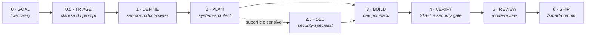
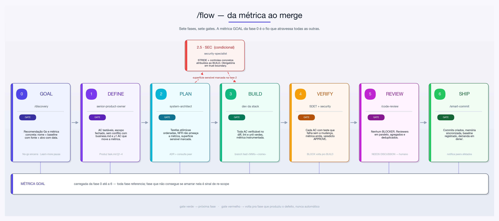
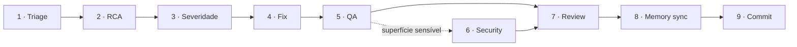
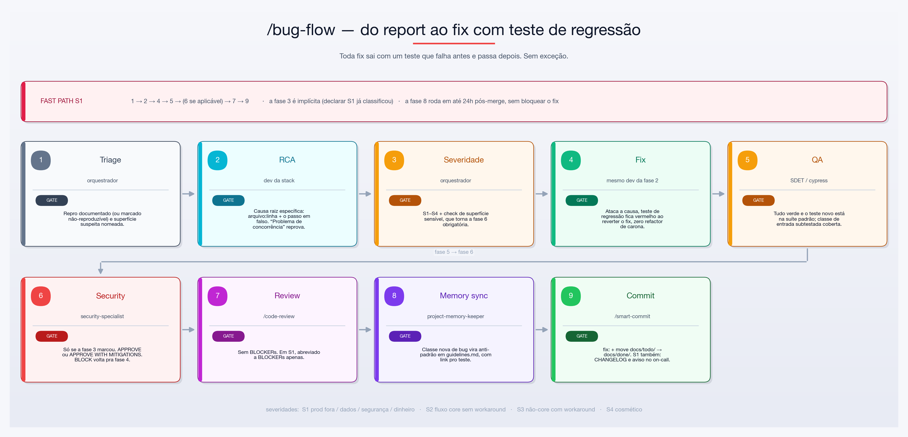
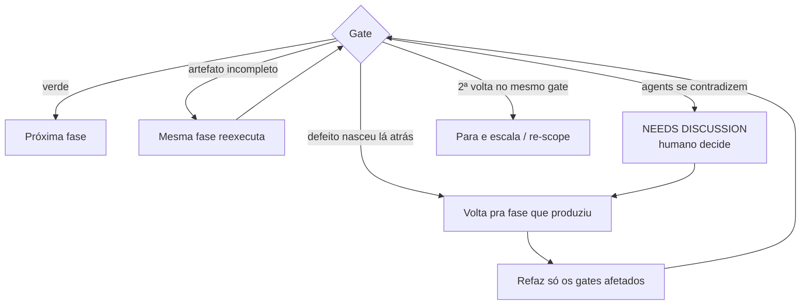
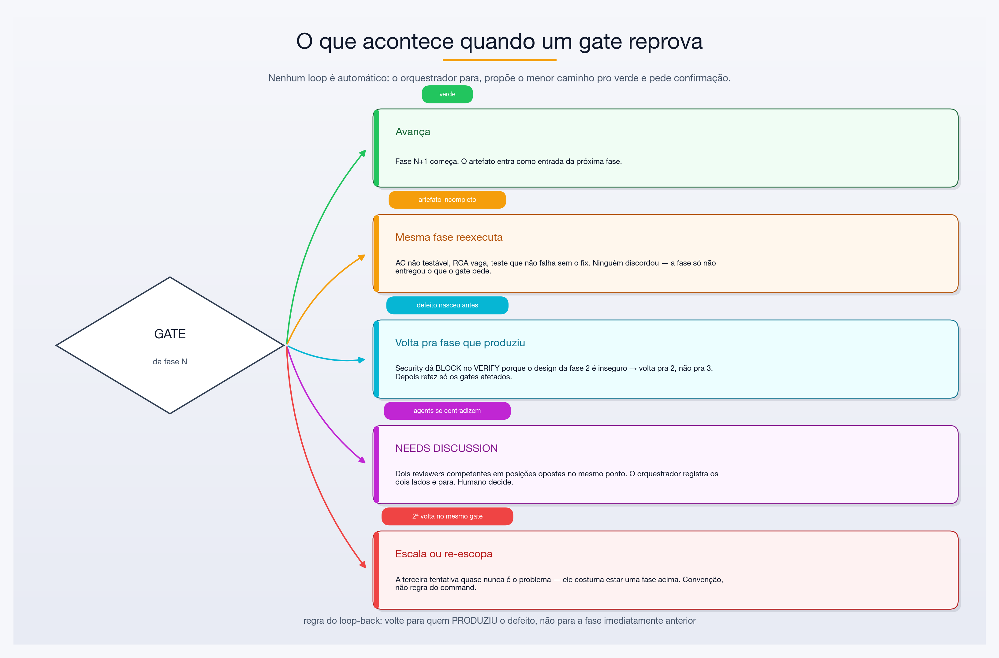
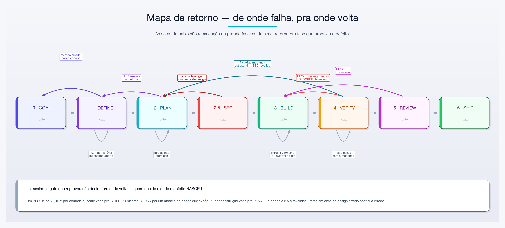
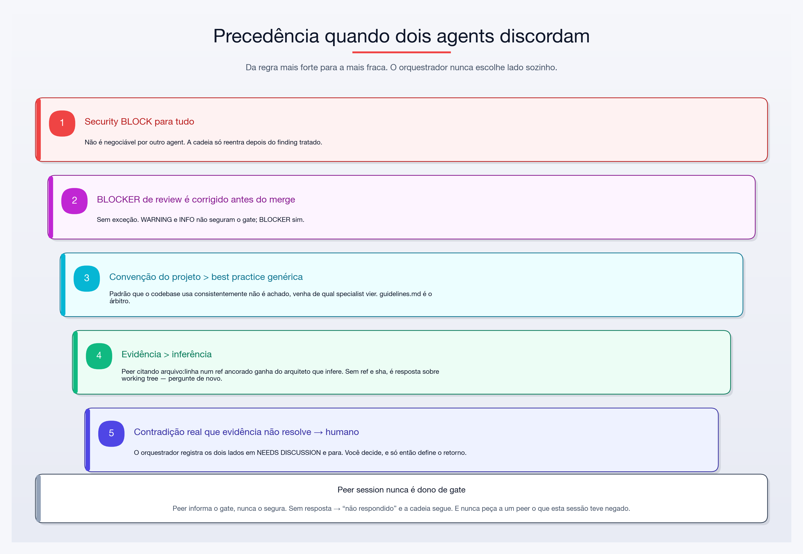

# Fluxos orquestrados: `/flow` e `/bug-flow`

> Guia de uso dos dois orquestradores com gate explícito entre fases. O que cada gate verifica, como rodar na prática, e o que acontece quando um gate reprova ou dois agents discordam.
>
> Visão geral de todos os commands: [USAGE.md](USAGE.md).
> Versão ilustrada em PDF, pronta pra imprimir ou compartilhar: **[guia-flow-bug-flow.pdf](flows/guia-flow-bug-flow.pdf)**.

---

## Índice

- [Qual fluxo usar](#qual-fluxo-usar)
- [Pré-requisitos](#pré-requisitos)
- [`/flow` — GOAL → SHIP](#flow--goal--ship)
  - [Cadeia de fases](#cadeia-de-fases)
  - [Faixa trivial (modo, não fase)](#faixa-trivial-modo-não-fase)
  - [Cada gate, em detalhe](#cada-gate-em-detalhe)
  - [Exemplo completo comentado](#exemplo-completo-comentado-flow)
- [`/bug-flow` — report → fix merged](#bug-flow--report--fix-merged)
  - [Cadeia de fases](#cadeia-de-fases-1)
  - [Cada gate, em detalhe](#cada-gate-em-detalhe-1)
  - [Fast path S1](#fast-path-s1)
  - [Exemplo completo comentado](#exemplo-completo-comentado-bug-flow)
- [Modelo de looping e discordância](#modelo-de-looping-e-discordância)
  - [As quatro formas de discordância](#as-quatro-formas-de-discordância)
  - [Regra do loop-back](#regra-do-loop-back-volte-para-quem-produziu-o-defeito)
  - [Matriz de retorno — `/flow`](#matriz-de-retorno--flow)
  - [Matriz de retorno — `/bug-flow`](#matriz-de-retorno--bug-flow)
  - [Precedência quando dois agents discordam](#precedência-quando-dois-agents-discordam)
  - [Convenção anti-loop-infinito](#convenção-anti-loop-infinito)
- [Anti-padrões](#anti-padrões)
- [Diagramas e PDF](#diagramas-e-pdf)
- [Cheat sheet](#cheat-sheet)

---

## Qual fluxo usar

| Situação | Command | Por quê |
|---|---|---|
| Ideia nova, mudança de produto, feature | **`/flow`** | Ancora a entrega numa métrica de sucesso antes de qualquer linha de código |
| Comportamento errado num sistema que já existe | **`/bug-flow`** | Prioriza RCA específica e teste de regressão |
| Feature, mas a métrica já está definida fora | `/feature-flow` | Mesma cadeia do `/flow` sem a fase GOAL — **superseded**, prefira `/flow` |
| Produção quebrada agora | `/incident-response` | Mitiga primeiro, investiga depois; cai em `/bug-flow` para o fix permanente |

A diferença entre `/flow` e `/feature-flow` é só a fase 0. Se você não consegue dizer qual número muda com a entrega, o `/flow` te obriga a descobrir isso antes — e isso é o ponto dele.

---

## Pré-requisitos

Os dois fluxos começam com um pre-flight obrigatório idêntico nas duas primeiras etapas:

1. **Memória do projeto carregada.** Precisa existir `.claude/memory/{business,architecture,guidelines}.md`. Se faltar, o fluxo **para** e pede `/bootstrap-project`.
2. **Intenção confirmada.** O orquestrador reformula o pedido em uma frase e confirma com você antes de gastar tokens na cadeia.
3. **ID da demanda alocado.** Próximo `NNN` (3 dígitos) varrendo `docs/todo/` e `docs/done/`; cria `docs/todo/<NNN>-<nome>/task.md` (flow) ou `bug.md` (bug-flow).
4. **(Só `/flow`, opcional) Descoberta de sessões peer.** `ListAgents` → uma sessão por repo afetado → handshake. Sem peer aberto, a cadeia roda idêntica.

O orquestrador **nunca escreve código**. Ele delega, avalia o gate e sintetiza.

---

## `/flow` — GOAL → SHIP

```
/flow reduzir o tempo de primeira resposta do suporte incluindo histórico de pedidos na tela do atendente
```

### Cadeia de fases



Cada seta é um **gate**. Gate que não está verde não passa — e a métrica GOAL da fase 0 é o fio que atravessa todas as outras: toda fase seguinte tem que conseguir se amarrar nela.



> *Diagrama em atualização: ele ainda não mostra a `0.5 · TRIAGE`. A cadeia vigente é a do mermaid acima.*

### Faixa trivial (modo, não fase)

A faixa trivial não é uma fase nova nem uma variante do diagrama acima — é um **modo** de percorrer as mesmas 8 fases, colapsadas, com teto de **4 subagents obrigatórios**: o dev da stack (BUILD), o `security-specialist` (security gate da VERIFY) e 1 revisor (REVIEW). `senior-product-owner` e `system-architect` não entram; DEFINE e PLAN saem numa seção curta escrita pelo próprio orquestrador.

**Critério de entrada (conjuntivo, citado no `task.md`, decidido no pre-flight, antes da GOAL — na faixa trivial a GOAL é de uma linha, sem `/discovery`):**

| Critério | Exige |
|---|---|
| F1 Escopo | diff previsto em **no máximo 1 arquivo de produção** (não conta o teste que prova a mudança nem arquivo gerado por script do repo) |
| F2 Superfície | **nenhuma** superfície sensível |
| F3 Contrato | **nenhum** endpoint, payload, schema compartilhado ou pacote publicado novo/alterado |
| F4 Tamanho de spec | **no máximo 3 AC** |
| F5 Decisão estrutural | **nenhum** ADR |

Critério sem citação (path, `path:line`, ou ausência verificável) conta como **não atendido** — fail-closed, o flow segue na faixa padrão. **Superfície sensível exclui a faixa trivial sempre**, na entrada e se aparecer no meio do flow, sem exceção nem critério de "a seu ver": se cair no meio, o flow sai da faixa, registra o critério que caiu e a fase em que caiu, e retoma na faixa padrão a partir do **DEFINE** — sem voltar à faixa trivial no mesmo flow. Nota da TRIAGE **≤ 6** (abaixo do corte) também tira a demanda da faixa trivial. A faixa trivial nunca remove o security gate da VERIFY.

Sem UI visível no diff, o revisor único é a lente de stack que o arquivo de produção dispara (ou, faltando uma, uma instância nova do dev do BUILD) — nunca o `system-architect`. Com UI visível, o revisor único é o agent de UX da plataforma — ver o gatilho de UX no Gate 2 → 3 · PLAN, logo abaixo.

### Cada gate, em detalhe

#### Gate 0 → 1 · GOAL

| | |
|---|---|
| **Roda** | `/discovery` |
| **Produz** | `docs/discovery/<slug>.md` — problem statement, usuários afetados, outcome JTBD, métrica de sucesso |
| **Verde quando** | recomendação é **Go** *e* a métrica é concreta: nome + baseline com fonte + alvo com data |
| **Amarelo** | **Learn-more** → pausa o fluxo até os experimentos sinalizados rodarem |
| **Vermelho** | **No-go** → encerra o fluxo |
| **Carry-forward** | métrica copiada pra `task.md` seção 0 como **GOAL metric** |

"Reduzir tempo de resposta" **não** passa. "TTFR mediano do suporte: 8m40s (baseline: dashboard support-ops, jul/2026) → 4m até 30/09" passa.

> Este é o gate que separa o `/flow` de uma cadeia de entrega comum. Se você não consegue produzir a métrica com baseline, você ainda não está pronto pra especificar — e o fluxo para aqui de propósito.

#### Gate 0.5 → 1 · TRIAGE

| | |
|---|---|
| **Roda** | o próprio orquestrador — **sempre**, diferente da 2.5, que é condicional |
| **Produz** | em `task.md` seção 0: a **nota** de 1 a 10 da clareza do prompt e **uma linha de justificativa por eixo** (A1 Deliverable · A2 Mechanism · A3 Done · A4 Stability) |
| **Verde quando** | a nota e as quatro justificativas estão gravadas, cada uma citando um artefato — **o DEFINE não inicia sem isso** |
| **Efeito** | nota **> 6** autoriza o DEFINE a fechar com **≤ 10 AC**, agrupando cenários relacionados; nota **> 6 _e_ superfície executável** (`bin/ahc`, `scripts/`, `install.sh`, `mcp/`, `test/` — este último só quando o teste é o **objeto** da mudança, não quando ele apenas a prova) faz o **PLAN acrescentar um bloco de performance com número**, orçamento ou medida; nota **≤ 6** roda o DEFINE exatamente como sempre |

A nota mede o **pedido**, não o problema: tamanho, complexidade e criticidade da demanda não entram nela. E menos AC nunca quer dizer AC mais frouxo — o gate da fase 4 continua exigindo teste que falha sem a mudança.

#### Gate 1 → 2 · DEFINE

| | |
|---|---|
| **Roda** | `senior-product-owner` |
| **Produz** | em `task.md`: descrição, segmento, stories INVEST, AC em Gherkin, out of scope, e a **ligação AC ↔ métrica GOAL** |
| **Verde quando** | AC são testáveis · escopo delimitado · nenhum conflito com `business.md` · **pelo menos uma AC move a métrica GOAL** |
| **Efeito de memória** | regra de domínio nova → `project-memory-keeper` atualiza `business.md` |

A cláusula que mais reprova aqui é a última: um conjunto de AC perfeitamente escrito que não move a métrica declarada na fase 0 significa que o escopo derivou. Volta pro PO.

#### Gate 2 → 3 · PLAN

| | |
|---|---|
| **Roda** | `system-architect` (+ `integration-architect` se for integração-pesado, + `postgres-dba` se for DB-pesado) |
| **Produz** | guia de implementação, trade-offs, abordagem recomendada, **decomposição em tarefas atômicas** mapeadas a AC, ADR se houver decisão estrutural; **bloco de performance com número** quando a 0.5 deu nota > 6 *e* a demanda toca superfície executável; **consulta de UX** registrada quando o gatilho abaixo disparar |
| **Verde quando** | tarefas atômicas e ordenadas por dependência · manutenibilidade e escalabilidade aceitáveis · **o impacto de NFR não ameaça a métrica GOAL** · superfície sensível marcada · gatilho de UX disparado sem registro de UX correspondente deixa o gate não verde |
| **Superfície sensível** | auth, authz, sessão, secrets, PII, pagamentos, upload/download, desserialização, SQL cru, shell exec, isolamento multi-tenant, nova integração externa / trust boundary |
| **Efeito de memória** | ADR + `architecture.md` |

**Gatilho de UX (condicional, fail-closed).** O plano toca arquivo de interface visível — componente, tela, widget, estilo, tokens/tema, asset ou copy exibida — e o `task.md` não cita, por arquivo, por que nada visível muda: dispara a consulta ao agent de UX **antes do BUILD**, cobrindo fluxo, estados (vazio, erro, carregando) e acessibilidade. Roteamento fixo: front web (React e afins) → `ux-designer-web`; Dart/Flutter ou mobile, React Native incluso → `ux-designer-mobile`; as duas plataformas → os dois. Refatoração sem mudança visível (hook, chamada de API, tipagem) **não** dispara, desde que citada. Na faixa trivial não há essa consulta no PLAN — o agent de UX entra direto como revisor único na REVIEW.

**Consulta peer (condicional).** Se o design muda um contrato que outro repo consome e há sessão aberta lá, o `/flow` pergunta o que aquele repo *de fato* consome hoje — ancorado em `origin/main`, com exigência de citar ref e sha. É onde um peer bate um subagent: o arquiteto infere, o peer lê. Contradição aqui vale um re-scope **antes** do BUILD, que é ordens de magnitude mais barato que descobrir no VERIFY.

#### Gate 2.5 → 3 · SEC (condicional)

| | |
|---|---|
| **Roda** | `security-specialist` — só se a fase 2 marcou superfície sensível. **Obrigatório** quando cruza trust boundary |
| **Produz** | tabela STRIDE + lista de "controles obrigatórios" na seção Security do `task.md` |
| **Verde quando** | os controles são **concretos e atribuídos ao BUILD** |

"Validar entrada" não é controle concreto. "Rejeitar `order_id` que não pertença ao `tenant_id` da sessão, com teste em `handler_test.go`" é.

#### Gate 3 → 4 · BUILD

| | |
|---|---|
| **Roda** | dev por stack detectada — Go → `go-senior-engineer` · .NET → `dotnet-backend-architect` · Node/TS → `nodejs-backend-architect` · Python → `python-engineer` · React → `senior-react-developer` · Postgres-pesado → `postgres-dba` junto · IaC → `aws-devops-engineer` |
| **Branch** | `feat/<nome>` ou `feat/<NNN>-<nome>` |
| **Produz** | código + testes unitários, **uma fatia atômica por vez**, seguindo `guidelines.md`. Instrumenta a métrica GOAL se ela ainda não for observável |
| **Verde quando** | toda AC é verificável no diff · lint e unit verdes localmente · métrica GOAL instrumentada ou já observável |

#### Gate 4 → 5 · VERIFY

| | |
|---|---|
| **Roda** | `go-sdet-backend` (Go) · `cypress-qa-analyst` (front/E2E) · `mobile-qa-analyst` (Flutter/React Native/nativo) · web + mobile → `cypress-qa-analyst` e `mobile-qa-analyst`; mobile + Go → `mobile-qa-analyst` e `go-sdet-backend`; front + back → os dois de cada lado; arquivo que casa com front e mobile (React Native) → só `mobile-qa-analyst` · **depois, sempre, `security-specialist`** |
| **Produz** | testes de integração/E2E/fuzz, matriz de rastreabilidade AC → teste, confirmação de que a métrica emite, **prova de RED por AC** |
| **Verde quando** | **toda AC tem ao menos um teste automatizado que falha sem a mudança** · a métrica GOAL emite e é consultável · veredicto de segurança é **APPROVE** ou **APPROVE WITH MITIGATIONS** · **prova de RED registrada e reproduzível por terceiro**, em qualquer faixa |
| **Vermelho** | **BLOCK** de segurança → volta pro BUILD · AC sem prova de RED → gate não verde |
| **Passagens** | teto de **3 sem ficar verde**; na 3ª, para e escala (ver [Convenção anti-loop-infinito](#convenção-anti-loop-infinito)) |

O critério "falha sem a mudança" é literal: um teste que passa tanto com quanto sem o patch não conta como cobertura de AC. A **prova de RED**, registrada na seção 8 do `task.md`, é a ref sem a mudança (sha alcançável da `main`), o comando exato e o trecho da saída vermelha que nomeia o teste — não basta afirmar que o teste falha sem a mudança.

**Faixa trivial.** Nenhum agent de QA é despachado nessa fase, `mobile-qa-analyst` incluído: a prova de RED de uma mudança mobile é o teste que o dev da stack escreveu no BUILD. Um flow Maestro marcado `NÃO EXECUTADO` nunca conta como prova de RED, em nenhuma faixa.

**Consulta peer (condicional).** Se a fase 2 marcou contrato cross-repo, pergunte ao peer se o diff que vai sair quebra o consumo dele — agora contra código real, não contra esboço. É **consultivo**: peer calado não segura o gate, mas peer reportando quebra é achado que entra no registro antes do SHIP.

#### Gate 5 → 6 · REVIEW

| | |
|---|---|
| **Roda** | `/code-review` — dispara em paralelo os specialistas aplicáveis ao diff (máx. 6), agrega e deduplica. Diff de UI visível vai pro `ux-designer-web`/`ux-designer-mobile`. Na faixa trivial, roda em modo revisor único |
| **Lê** | o veredito **recalculado** após a verificação adversarial do `/code-review` (Step 4, item 7), nunca o anterior |
| **Verde quando** | **nenhum BLOCKER** *e* **nenhuma lente faltante** — veredito `INCOMPLETE` (revisor que falhou, estourou o tempo ou saiu fora do formato) nunca é verde, nem na faixa trivial com o revisor único |
| **Passagens** | teto de **3 sem ficar verde** (REVIEW→BUILD); na 3ª, para e escala |
| **Cuidado** | veredicto **NEEDS DISCUSSION** significa que dois reviewers se contradisseram; ver [discordância](#as-quatro-formas-de-discordância). `NEEDS DISCUSSION` não consome passagem |

#### Gate 6 · SHIP

| | |
|---|---|
| **Roda** | `/smart-commit` + fechamento |
| **Ações** | `project-memory-keeper` sincroniza memória com **o que de fato saiu** (não com o que foi planejado) — na faixa padrão, sempre; só na faixa trivial o sync é condicional: roda quando a mudança altera algo que a memória descreve (com citação), senão a seção 10 registra `nada a sincronizar: <citação>` · registra o **baseline da métrica no momento do ship** · notifica peers de repos afetados (só notificação — nunca peça pra mudarem código) · move `docs/todo/<NNN>-…/` → `docs/done/<NNN>-…/` |
| **Verde quando** | commits criados · memória sincronizada (na faixa trivial, também `nada a sincronizar` citado) · baseline registrado · demanda movida |

### Exemplo completo comentado (`/flow`)

```
/flow reduzir o tempo de primeira resposta do suporte incluindo histórico de pedidos na tela do atendente
```

**Pre-flight**

```
Memória carregada: business.md, architecture.md, guidelines.md ✅
Entendi: expor os últimos pedidos do cliente na tela do atendente pra cortar
o tempo até a primeira resposta. Confirma?  → sim
Demanda alocada: docs/todo/047-historico-pedidos-atendente/task.md
Peers: orders-api-3f (handshake ok — git@github.com:ems/orders-api.git, main, 9c1a4e2, clean)
```

**Fase 0 — GOAL**

```
[047-historico-pedidos-atendente] GOAL — /discovery — PASS
  Produced: docs/discovery/historico-pedidos-atendente.md
  GOAL metric: TTFR mediano do suporte — 8m40s (support-ops dashboard, jul/2026) → 4m até 30/09
  Recommendation: Go
  Next: DEFINE — senior-product-owner
```

**Fase 1 — DEFINE** — o PO devolve 3 stories e 6 AC. Uma delas:

```gherkin
Scenario: atendente abre um ticket de cliente com pedidos recentes
  Given um cliente com ao menos 1 pedido nos últimos 90 dias
  When o atendente abre o ticket
  Then os 5 pedidos mais recentes aparecem no painel lateral em até 500ms
  # Moves GOAL metric? sim — remove a troca de aba pro admin, que é o maior
  # bloco de tempo medido antes da primeira resposta
```

**Fase 2 — PLAN** — o arquiteto propõe um endpoint novo no `orders-api` consumido pelo front do suporte. Contrato cross-repo → dispara consulta peer:

```
SendMessage → orders-api-3f:
  "Vou adicionar GET /v1/customers/{id}/orders?limit=5 no orders-api.
   Responda a partir de origin/main — não da sua working tree.
   Existe endpoint equivalente hoje? Qual o shape de OrderSummary e quais
   campos são obrigatórios? Cite ref, sha curto, arquivo e linha. Não altere nada."

← resposta (origin/main@9c1a4e2, internal/api/orders.go:88):
  "Já existe GET /v1/orders?customer_id=&limit= com o mesmo shape.
   OrderSummary tem id, status, total_cents, created_at — todos obrigatórios."
```

Registrado em `task.md` §9. O plano muda: reusar o endpoint existente em vez de criar um novo. Uma tarefa a menos e zero mudança de contrato — **este é o retorno de um peer que um subagent não conseguiria dar**, porque ele só poderia inferir.

```
[047-…] PLAN — system-architect — PASS
  Produced: task.md §5, ADR-0012 (cache do painel lateral)
  GOAL metric: TTFR — traceable? yes (NFR de 500ms é a AC #3)
  Peer consult: orders-api-3f → endpoint já existe; plano reduzido de 5 pra 4 tarefas
  Sensitive surface: PII (dados de pedido de cliente) → SEC obrigatória
  Next: SEC — security-specialist
```

**Fase 2.5 — SEC** — STRIDE aponta *Information Disclosure*: o front do suporte poderia pedir pedidos de qualquer `customer_id`. Controle obrigatório atribuído ao BUILD: checagem de escopo do atendente + teste.

**Fase 3 — BUILD** → `nodejs-backend-architect` no front + `go-senior-engineer` no `orders-api` consumer. Instrumenta o timer `support.ttfr`.

**Fase 4 — VERIFY** — 6 AC, 6 testes, todos falhando sem o patch. Security gate valida que o controle da 2.5 aterrissou. Peer confirma que o consumo não quebrou.

**Fase 5 — REVIEW** — `/code-review` devolve 1 WARNING (cache sem TTL explícito), zero BLOCKER → passa.

**Fase 6 — SHIP**

```
[047-historico-pedidos-atendente] SHIPPED — branch: feat/047-historico-pedidos-atendente
  Phases:    GOAL ✅  DEFINE ✅  PLAN ✅  (SEC ✅)  BUILD ✅  VERIFY ✅  REVIEW ✅  SHIP ✅
  GOAL:      TTFR mediano — baseline 8m40s → target 4m até 30/09 (baseline@ship: 8m31s)
  Files:     7 created, 11 modified
  ADRs:      ADR-0012
  AC:        6/6 covered
  Security:  APPROVE
  Peers:     1 consulted, 1 repo notified
  Follow-ups: medir TTFR em 14/09 e comparar com o baseline@ship
  legend:    ✅ pass · ➖ skipped (not triggered) · ❌ blocked
```

---

## `/bug-flow` — report → fix merged

```
/bug-flow autovacuum não roda em public.events e bloat passou de 40% — ver thread no Slack #db
```

### Cadeia de fases





### Cada gate, em detalhe

#### Gate 1 · Triage & isolação

Dono: o orquestrador. Reproduz localmente se der; se não der, **documenta a lacuna explicitamente**. Localiza arquivo e linha suspeitos e lê o código ao redor, não só a linha que estourou.

**Verde quando:** o repro está documentado (ou marcado "não-reproduzível — faltam dados") **e** a superfície suspeita tem nome.

#### Gate 2 · RCA

Agent por stack (mesmo mapa do BUILD do `/flow`, mais `integration-architect` pra cross-service). Recebe repro, stack trace, arquivos suspeitos e diffs recentes na área (`git log`, `git blame`).

**Verde quando a causa raiz é específica.** Este gate é literal e é o mais reprovado do fluxo:

| ❌ Não passa | ✅ Passa |
|---|---|
| "problema de concorrência" | "`internal/cache/cache.go:142` — compare-and-swap não atômico com N≥2 escritores" |
| "o autovacuum está mal configurado" | "`public.events` tem `autovacuum_vacuum_scale_factor=0.2` herdado do default; com 40M linhas o threshold só dispara a cada 8M tuplas mortas" |

**Efeito de memória:** se o bug é instância de um anti-padrão que já está em `guidelines.md`, isso é uma **regressão** e precisa ser sinalizada. Se é classe nova, `project-memory-keeper` adiciona depois do fix.

#### Gate 3 · Severidade & impacto

| Sev | Significa | Caminho |
|---|---|---|
| **S1** | prod fora, perda de dados, brecha de segurança, dinheiro em risco | hotfix ([fast path](#fast-path-s1)) |
| **S2** | fluxo core quebrado pra muitos usuários, sem workaround confiável | normal, prioridade alta |
| **S3** | fluxo não-core degradado, com workaround | normal |
| **S4** | cosmético / edge case / sem impacto visível | normal |

**Check de superfície sensível:** bug em ou perto de auth, authz, secrets, PII, pagamentos, manipulação de arquivo, desserialização, SQL cru, isolamento multi-tenant → marca a fase 6 como **obrigatória**.

#### Gate 4 · Fix

Mesmo agent da fase 2. Branch `fix/<nome>`.

**Verde quando:** a causa raiz foi atacada (não o sintoma) · existe **teste de regressão que falha antes do fix e passa depois** · **nenhuma refatoração de carona**.

O teste de regressão é verificado revertendo o fix e confirmando que o teste fica vermelho. Escreva o teste primeiro sempre que der.

#### Gate 5 · QA / regressão

`go-sdet-backend` e/ou `cypress-qa-analyst`. Valida o teste de regressão, adiciona testes adjacentes se a RCA sugere uma **classe** de entradas subtestada (boundary, fuzz, race), e faz smoke na área ao redor.

**Verde quando:** tudo verde e o teste novo está na suíte padrão — não num arquivo que ninguém roda.

#### Gate 6 · Security (condicional, obrigatório se a fase 3 marcou)

`security-specialist` audita o diff especificamente pela superfície marcada.
**Verde:** APPROVE ou APPROVE WITH MITIGATIONS (mitigações registradas em `architecture.md`). **BLOCK volta pra fase 4.**

#### Gate 7 · Review

`/code-review`. **Verde quando:** sem BLOCKERs.

#### Fase 8 · Memory sync

`project-memory-keeper`: classe nova de vulnerabilidade → `guidelines.md` (o anti-padrão + o idioma correto + link pro teste que impede recorrência). NFR/ameaça/controle errado exposto → `architecture.md`. Mal-entendido de regra de domínio → `business.md`.

#### Fase 9 · Commit & close

`/smart-commit` com tipo `fix:`. Move `docs/todo/<NNN>-…/` → `docs/done/`. Em S1, também: CHANGELOG e um parágrafo de resumo no canal de on-call (o canal está em `architecture.md` § Operations).

### Fast path S1

```
1 → 2 → 4 → 5 → (6 se aplicável) → 7 → 9        [8 em até 24h pós-merge]
```

A fase 3 é implícita: **declarar S1 já é classificar a severidade**. A fase 7 continua obrigatória, mas abreviada a BLOCKERs. A fase 8 não bloqueia o fix — e também não é pulada.

### Exemplo completo comentado (`/bug-flow`)

```
/bug-flow o contador de itens no carrinho às vezes fica menor que o número real
depois de dois adds rápidos — reprodução intermitente em staging, sem stack trace
```

**Fase 1 — Triage**

```
[052-carrinho-contador-perdido] Phase 1 — orchestrator — PASS
  Repro: 2 POST /cart/items concorrentes no mesmo cart_id → contador incrementa 1x
         (10 execuções, falha em 6). Documentado em bug.md §2.
  Suspeita: internal/cart/counter.go (read-modify-write sem lock)
  Next: Phase 2 — go-senior-engineer
```

**Fase 2 — RCA** — o `go-senior-engineer` devolve:

```
Defect: internal/cart/counter.go:74 — `c.count = c.count + n` sob RWMutex tomado
        em RLock (leitura) e não em Lock (escrita). Dois writers concorrentes leem
        o mesmo valor e escrevem o mesmo resultado; um incremento é perdido.
Por que não foi pego: TestCounterAdd é sequencial; não há teste com -race.
Hipóteses descartadas: retry do cliente (logs mostram 2 requests distintos, IDs
        diferentes); cache stale (o valor errado persiste no banco).
```

Específico, com evidência e arquivo:linha → **gate verde**.

**Fase 3 — Severidade** — S2 (fluxo core, sem workaround; o cliente perde item silenciosamente). Superfície sensível: **nenhuma** → fase 6 não roda.

**Fase 4 — Fix** — teste primeiro:

```go
func TestCounterAdd_Concurrent(t *testing.T) {  // falha com -race antes do fix
    c := NewCounter()
    var wg sync.WaitGroup
    for i := 0; i < 100; i++ { wg.Add(1); go func() { defer wg.Done(); c.Add(1) }() }
    wg.Wait()
    if got := c.Value(); got != 100 { t.Fatalf("got %d, want 100", got) }
}
```

Fix: `RLock` → `Lock` no caminho de escrita. 1 arquivo, 2 linhas. Revertido o fix, o teste fica vermelho — gate verde.

**Fase 5 — QA** — `go-sdet-backend` nota que a RCA aponta uma *classe*: todos os writers do pacote `cart`. Encontra o mesmo padrão em `internal/cart/reservations.go:51` e adiciona teste + fix. Suíte roda com `-race` no CI a partir daqui.

**Fase 7 — Review** — `/code-review`, zero BLOCKER.

**Fase 8 — Memory sync** — classe nova → `guidelines.md` ganha "RWMutex: `RLock` nunca protege read-modify-write; use `Lock`" + link pro teste.

```
[052-carrinho-contador-perdido] DONE — branch: fix/052-carrinho-contador-perdido — severity: S2
  RCA:        RLock usado em caminho de escrita em counter.go:74; incremento perdido sob concorrência
  Files:      4 changed
  Tests:      regressão em internal/cart/counter_test.go + reservations_test.go; CI agora roda -race
  Security:   n/a
  Memory:     guidelines.md (anti-padrão RWMutex)
  Follow-ups: varrer os outros pacotes pelo mesmo padrão (task 053)
```

---

## Modelo de looping e discordância

Um gate reprovado **não** é um erro do fluxo — é o fluxo funcionando. O que importa é pra onde a cadeia volta, quem decide, e como ela não gira em círculo.

### As quatro formas de discordância

**1. Gate reprova o artefato da própria fase.** O mais comum: AC não testável, RCA vaga, teste que não falha sem o fix. Ninguém discorda de ninguém — a fase simplesmente não entregou o que o gate pede. **A fase reexecuta, não volta.**

**2. Gate reprova por causa de uma decisão tomada lá atrás.** Security dá BLOCK no VERIFY porque o *design* da fase 2 é que é inseguro. Aqui a cadeia volta de verdade — e volta pra fase 2, não pra 3.

**3. Dois agents na mesma fase se contradizem.** É o caso do `/code-review`, que roda reviewers em paralelo. O command resolve assim:

- **Mesmo `file:line`, mesmo problema** → deduplica, mantém a severidade mais estrita, credita os dois em "raised by".
- **Recomendações genuinamente opostas** ("faça X" vs. "faça Y" no mesmo ponto) → o command **não escolhe lado**. O achado vai pra seção *Conflitos entre reviewers* e o veredicto geral vira **NEEDS DISCUSSION**. **Quem decide é você.**
- **Fora da própria lente** → não é discordância, é ruído. Um reviewer de React não reporta problema de SQL; o `postgres-dba` está no mesmo diff em paralelo.

**4. Um peer contradiz o design.** A resposta do peer é **evidência, não veredicto** — ela vem de um contexto que você não enxerga. Se ela muda uma decisão, confirme contra algo concreto (um arquivo, um contrato, um teste) antes de agir. E peer **nunca** segura gate: peer calado vira "não respondido" e a cadeia segue.

### Regra do loop-back: volte para quem produziu o defeito

> Volte para a fase que **produziu o artefato defeituoso**, não para a fase imediatamente anterior.

Um BLOCK de segurança no VERIFY causado por um controle ausente volta pro BUILD. O mesmo BLOCK causado por um modelo de dados que expõe PII por construção volta pro PLAN — e obriga a 2.5 a revalidar. Voltar pro BUILD nesse segundo caso só produz um patch em cima de um design que continua errado.

Reexecutar uma fase reexecuta os gates a jusante **que foram afetados**. Consertar um teste no VERIFY não obriga a refazer o PLAN; mudar o contrato no PLAN obriga a refazer tudo depois dele.

E o loop **nunca é automático**. Em `BLOCK` ou `No-go` o orquestrador para, mostra o achado que bloqueia, propõe o menor caminho pro verde e **pede sua confirmação antes de tentar de novo**.





### Matriz de retorno — `/flow`



| Gate | Achado | Volta pra | Observação |
|---|---|---|---|
| 0 GOAL | **No-go** | — | Encerra o fluxo |
| 0 GOAL | **Learn-more** | 0 | Pausa até os experimentos rodarem; reentra na 0 |
| 0.5 TRIAGE | Nota sem justificativa por eixo, ou eixo sem citação | 0.5 | Só reescrita da justificativa; o DEFINE não inicia sem ela |
| 1 DEFINE | AC não testável / escopo aberto | 1 | PO reescreve |
| 1 DEFINE | Nenhuma AC move a métrica | 1 · ou 0 | 1 se o escopo derivou; **0** se a métrica é que estava errada |
| 2 PLAN | Tarefas não atômicas | 2 | Só redecomposição |
| 2 PLAN | NFR ameaça a métrica GOAL | 1 · ou 0 | Re-scope; se o alvo é inatingível por construção, volta pra 0 |
| 2 PLAN | Peer contradiz o contrato | 2 | 1 se o escopo muda junto |
| 2.5 SEC | Controles vagos | 2.5 | Só reescrita dos controles |
| 2.5 SEC | Controle exige mudança de design | 2 | Depois a 2.5 revalida |
| 3 BUILD | Lint/unit vermelho, AC invisível no diff | 3 | |
| 4 VERIFY | Teste não falha sem a mudança | 4 | Problema é o teste, não o código |
| 4 VERIFY | Teste vermelho por bug real | 3 | |
| 4 VERIFY | Métrica GOAL não emite | 3 | Instrumentação faltando |
| 4 VERIFY | Security **BLOCK** | 3 · ou 2 | **2** quando o fix é estrutural — e a 2.5 revalida |
| 4 VERIFY | Peer reporta quebra cross-repo | 2 | Registre em §9 mesmo que decida seguir |
| 5 REVIEW | **BLOCKER** | 3 · ou 2 | 2 se for arquitetural |
| 5 REVIEW | **NEEDS DISCUSSION** | — | **Humano decide primeiro**; só depois define o retorno |
| 6 SHIP | Commit/memória falha | 6 | Corrige no lugar |

### Matriz de retorno — `/bug-flow`

| Gate | Achado | Volta pra |
|---|---|---|
| 1 Triage | Não reproduz e não há dados | 1 — marca "não-reproduzível", pede dados ao reporter |
| 2 RCA | Causa vaga ("problema de concorrência") | 2 |
| 2 RCA | Causa é sintoma de outra mais funda | 2 |
| 4 Fix | Trata sintoma, não a causa | 4 |
| 4 Fix | Teste de regressão não vira vermelho ao reverter o fix | 4 |
| 4 Fix | Refatoração de carona no diff | 4 — separa em outra task |
| 5 QA | Colateral quebrado | 4 |
| 5 QA | RCA aponta classe subtestada | 4 — amplia o fix, como no exemplo do `cart` |
| 6 Security | **BLOCK** | **4** (explícito no command) |
| 7 Review | **BLOCKER** | 4 |
| 7 Review | **NEEDS DISCUSSION** | Humano decide antes de voltar |
| 8 Memory | — | Não é gate; em S1 acontece em até 24h pós-merge |

### Precedência quando dois agents discordam



Da regra mais forte pra mais fraca:

1. **Security BLOCK para tudo.** Não é negociável por outro agent; a cadeia só reentra depois do finding tratado.
2. **BLOCKER de review tem que ser corrigido antes do merge** — sem exceção.
3. **Convenção do projeto ganha de best practice genérica.** Um padrão que o codebase usa consistentemente não é achado, venha de qual specialist vier. `guidelines.md` é o árbitro.
4. **Evidência ganha de inferência.** Peer que cita `arquivo:linha` num ref ancorado ganha de arquiteto que infere. Peer sem ref e sha é resposta sobre working tree — trate como não respondida e pergunte de novo, ancorada.
5. **Contradição real que evidência não resolve → humano.** O orquestrador registra os dois lados e para. Ele nunca escolhe lado sozinho.

### Convenção anti-loop-infinito

No `/flow`, isto é **regra escrita no command**: os gates da VERIFY (BUILD↔VERIFY) e da REVIEW (REVIEW→BUILD) têm **teto de 3 passagens** sem ficar verde — uma passagem inicial mais duas voltas. Na 3ª passagem sem verde o flow **para**, marca a fase `bloqueada` e escala ao usuário com o achado que não fecha, as 3 tentativas e o que mudou em cada uma; nunca avança de fase, nunca faz SHIP e nunca marca o gate como verde sem decisão explícita do usuário registrada no `task.md`. No `/bug-flow`, que não tem esse teto escrito no command, a mesma contagem segue valendo como **convenção de uso recomendada**.

- **Três passagens sem ficar verde no mesmo gate → pare.** (1 tentativa inicial + 2 voltas.) A terceira quase nunca é o problema; o problema costuma estar uma fase acima. Escale pro humano ou re-escope.
- **Registre cada passagem no `task.md` / `bug.md`**, com fase, achado e o que mudou. Sem isso ninguém enxerga que já foram três.
- **Volta que sobe de fase reinicia a contagem.** Voltar do VERIFY pro PLAN é um caminho novo, não a terceira tentativa do mesmo gate.
- **`NEEDS DISCUSSION` não consome passagem.** Ele suspende a cadeia esperando decisão humana; nada foi tentado ainda.

---

## Anti-padrões

| ❌ | Por quê |
|---|---|
| Pular fase "pra ganhar tempo" | Os gates **são** o valor. Cadeia sem gate é só delegação em série |
| Rodar `/flow` sem métrica com baseline | A fase 0 para de propósito. Sem métrica você não está pronto pra especificar |
| O orquestrador escrever código | Ele delega, avalia gate e sintetiza. Código é do dev da stack |
| Pedir a um peer o que esta sessão teve negado | Isso contorna uma decisão que **você** tomou. Trabalho bloqueado volta pro usuário |
| Perguntar pra três sessões do mesmo repo | Não são três fontes — é um repo visto de três checkouts. Uma por repo, ancorada em ref |
| Deixar um gate esperando peer | Peer informa gate, nunca é dono dele. Sem resposta → "não respondido" e segue |
| Refatoração de carona no `/bug-flow` | Bug fix é uma mudança só. Limpeza vai pro `/flow` ou task própria |
| Aceitar RCA de uma linha vaga | "Problema de concorrência" não é causa raiz; é a descrição do sintoma |
| Escolher lado num `NEEDS DISCUSSION` | O conflito existe porque dois specialists competentes discordaram. É decisão humana |

---

## Diagramas e PDF

| Arquivo | O que é |
|---|---|
| [`flows/guia-flow-bug-flow.pdf`](flows/guia-flow-bug-flow.pdf) | Guia ilustrado de 16 páginas, A4 — este documento em formato de apostila |
| [`flows/guia.html`](flows/guia.html) | Fonte do PDF (impresso via Chrome headless) |
| `flows/render.py` | Gera os diagramas largos usados aqui (tela) — `python3 docs/flows/render.py` |
| `flows/render_print.py` | Gera as versões dimensionadas pra página A4 usadas no PDF |

Pra regerar tudo depois de mudar os commands:

```bash
python3 docs/flows/render.py
cd docs/flows && python3 render_print.py
"/Applications/Google Chrome.app/Contents/MacOS/Google Chrome" --headless --disable-gpu \
  --no-pdf-header-footer --print-to-pdf="guia-flow-bug-flow.pdf" "file://$PWD/guia.html"
```

## Cheat sheet

```
/flow <ideia>                    GOAL → TRIAGE → DEFINE → PLAN → (SEC) → BUILD → VERIFY → REVIEW → SHIP
/bug-flow <sintoma + evidência>  Triage → RCA → Sev → Fix → QA → (Sec) → Review → Memory → Commit

Faixa trivial (/flow)
  Entra se, citado no task.md: ≤ 1 arquivo de produção · nenhum contrato novo/alterado ·
  ≤ 3 AC · nenhum ADR · nenhuma superfície sensível (sem exceção, nunca)
  8 fases continuam presentes, colapsadas — ≤ 4 subagents obrigatórios (dev · security gate · 1 revisor)
  Critério sem citação ou que cai no meio do flow → sai da faixa, retoma padrão a partir do DEFINE

Artefatos
  docs/discovery/<slug>.md              brief da fase GOAL
  docs/todo/<NNN>-<nome>/task.md        demanda de feature, seções 0–10
  docs/todo/<NNN>-<nome>/bug.md         demanda de bug, seções 1–6
  docs/done/<NNN>-<nome>/               pra onde vai no SHIP / fase 9
  docs/adr/ADR-NNNN-*.md                decisões estruturais da fase PLAN
  .claude/memory/{business,architecture,guidelines}.md

Vocabulário de gate
  Go / No-go / Learn-more               fase GOAL
  APPROVE / APPROVE WITH MITIGATIONS    security-specialist — verde
  BLOCK                                 security-specialist — para a cadeia
  APPROVED / …WITH COMMENTS             /code-review — verde
  CHANGES REQUESTED                     /code-review — tem BLOCKER
  INCOMPLETE                            /code-review — falta lente de revisor, nunca é verde
  NEEDS DISCUSSION                      /code-review — reviewers se contradisseram → humano

UX (/flow)
  Diff toca UI visível → ux-designer-web (web) / ux-designer-mobile (Dart/Flutter, React Native, mobile)
  Consult no PLAN, antes do BUILD · lente de UX/a11y na REVIEW · sem UI visível, não dispara

Regra do loop-back
  Volte pra fase que PRODUZIU o defeito, não pra anterior imediata.
  Nenhum loop é automático — o orquestrador propõe e você confirma.
  /flow: teto de 3 passagens por gate (VERIFY, REVIEW) — regra escrita no command, escala ao estourar.
  /bug-flow: duas voltas no mesmo gate → pare e escale (convenção de uso).
```
