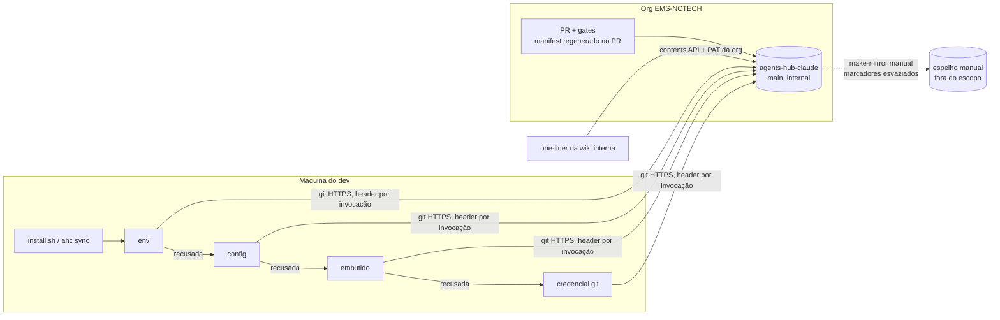

# ADR-0001: Acesso ao hub dentro da org: PAT da EMS-NCTECH, cascata de credenciais e injeção por invocação no ahc

**Status:** Proposed
**Data:** 2026-09-14 (revisado em 2026-09-15: a distribuição volta a ser 100% dentro da org; e em 2026-09-16: gate de segredos da org e exceção de merge — ver a última seção)
**Demanda:** `docs/todo/001-ahc-pat-auth/task.md` (§5)
**Decisores:** lead do hub (escopo, origem de distribuição e riscos aceitos), system-architect (desenho)

## Contexto

O `install.sh` (`install.sh:21-28`) e o `ahc` (`gitRefresh`, `bin/ahc:103-119`; check `git auth`, `bin/ahc:526-546`) só alcançam o hub usando a credencial git da máquina. Um dev sem credential helper nem `gh auth` fica com 0% de sucesso em install + sync (reprodução de 2026-09-14: `git clone` exit 128, "could not read Username").

Decisões do lead, **fora de discussão neste ADR**:
- **Origem única dentro da org (2026-09-15):** install, sync, list e doctor usam só o repo canônico `EMS-NCTECH/agents-hub-claude` (`internal`), alcançado pelos controles de acesso da própria org. Nenhuma cópia automática para repo fora da org. O espelho manual segue fora do escopo.
- **Token de leitura:** PAT fine-grained cujo **dono dos recursos é a org `EMS-NCTECH`**, criado pela conta do lead (membro da org, admin do repo), limitado a `EMS-NCTECH/agents-hub-claude` com `Contents: Read` + `Metadata: Read`. Não existe conta de serviço. Fixo no código; distribuído pelo one-liner da wiki interna e pelo próprio código; vazamento aceito; sem cofre.
- **Cascata:** `AHC_GITHUB_TOKEN` (env) → `token` da config → token embutido → credencial git do dev. Vence a primeira que autentica; falha só quando todas são recusadas.
- Reinstalar preserva o `token` da config, com modo 600.
- Dev sem credencial instala por um one-liner `curl ... | bash` publicado na wiki interna.

Histórico: em 2026-09-14 o escopo passou a "espelho pessoal como origem com publicação automática". Em 2026-09-15 esse re-escopo foi revertido (ver opção 4-B, rejeitada).

Fatos do repo e da org:
- Hub `internal`, mais de 50 devs usando `ahc sync`; secret scanning e push protection **do GitHub** desligados (API, 2026-09-14). **Corrigido em 2026-09-16:** esse levantamento não cobriu os *rulesets* da org, que exigem os checks `Datadog PR Gates` na `main` (rulesets `Datadog Security PR Gate - Block - NPROD` e `- PRD`, ambos `enforcement=active`). O check `No new secrets violations` **reprova o literal embutido** e bloqueia o merge; o PR #21, sem o literal, passou no mesmo check.
- **Ruleset da org × regen do manifest:** no push para `main`, o `regen-manifest.yml` tenta fazer auto-commit do manifest com `GITHUB_TOKEN` e `[skip ci]`, e o ruleset da org recusa (`push declined due to repository rule violations`). Por isso a `main` canônica ficou vermelha desde o PR #20 (sha antigo em `skills/session-cost`). A correção foi regenerar o manifest dentro do PR da demanda (`1733caa`), e manifests passam a ser regenerados dentro dos PRs. Este ADR não muda o `regen-manifest.yml`.

Verificado localmente em 2026-09-14 (git 2.50.1):
- `GIT_CONFIG_COUNT` injeta config sem gravar nada em disco, e `credential.helper=` vazio por env anula os helpers de sistema e global.
- Um `http.extraHeader` injetado por env vai já no primeiro `GET info/refs`. Um 401 nessa rodada termina em "could not read Username" sem apresentar outra credencial.
- Na rodada sem header e com helper, o git faz um GET anônimo, apresenta a credencial do helper e, se recusada, termina em "Authentication failed".
- Um cache `clone --depth=1` que roda `fetch --depth=1` + `reset --hard FETCH_HEAD` aceita um histórico remoto sem relação (force push), tanto com URL explícita quanto com `fetch origin main`.

E1 de 2026-09-14 (contra o espelho, com o token antigo; valida o mecanismo, não o token da org):
- Com o token só por `GIT_CONFIG_COUNT`/`http.extraHeader` e HOME limpo, `ls-remote`, `clone --depth=1` e `fetch` + `reset --hard FETCH_HEAD` em cache existente terminaram com exit 0. O mesmo `fetch` sem token terminou com exit 128. `.git/config` e HOME ficaram sem credencial.
- Um token que autentica mas não tem leitura do repo recebeu **403 "Write access to repository not granted"** no git e 404 na API.
- O E1 contra o canônico com o PAT da org está pendente (T0).

Decisões técnicas em aberto:
1. Como cada origem chega ao git sem ir parar em URL, `.git/config`, argv ou `~/.gitconfig` (F3).
2. O que conta como recusa.
3. Onde vive o literal do token.
4. De onde os devs instalam e sincronizam.

## Opções consideradas

### 1. Injeção da credencial

| Opção | Nada em disco/URL | Nada em argv | Resolve F3 | Não mexe no `~/.gitconfig` | Custo / risco |
|---|:--:|:--:|:--:|:--:|---|
| A. Token na URL (`https://x-access-token:<t>@github.com/...`) | ✗ | ✗ | ✗ (`origin` mantém o token velho) | ✓ | Rejeitada |
| B. `git -c http.extraHeader=...` | ✓ | ✗ | ✓ | ✓ | Rejeitada (`ps`) |
| **C. `GIT_CONFIG_COUNT`: header `Authorization: Basic` + reset de `credential.helper`/`http.extraHeader`** | ✓ | ✓ | ✓ | ✓ | Exige git >= 2.31 |
| D. Credential helper efêmero por env | ✓ | ✓ | ✓ | ✓ | +1 round-trip; troca `store`/`erase` com o helper |
| E. Isolar a config (`GIT_CONFIG_GLOBAL=/dev/null` + NOSYSTEM) | ✓ | ✓ | ✓ | ✓ | Perde proxy/CA corporativos: regressão |
| F. `GIT_CONFIG_PARAMETERS` | ✓ | ✓ | ✓ | ✓ | Formato interno, não documentado |

### 2. O que avança a cascata

| Opção | Efeito |
|---|---|
| Só 401 | Um token sem leitura recebe 403 "Write access to repository not granted" (visto no E1) ou 404, e a cascata pararia antes da credencial do dev |
| **401/403 sempre, 404 nas rodadas de token; rede e timeout nunca** | Cobre revogação, expiração, token sem leitura e conta do lead sem acesso. Typo no slug custa ≤ 4 falhas rápidas. Rede fora não multiplica a latência |
| Qualquer falha | Rede fora multiplicaria o timeout por 4 no SessionStart |

### 3. Onde vive o token embutido

| Opção | Funciona no one-liner e no sync | Custo / risco |
|---|:--:|---|
| **1. Literal nos marcadores `AHC-EMBEDDED-TOKEN` de `bin/ahc` e `install.sh` no canônico + teste de marcador único e igualdade** | ✓ | Dois literais (drift barrado pela CI). O token fica no repo `internal` da org, sem alerta de secret scanning. Rotação = PR + reinstalação; env/config cobrem a janela |
| 2. Marcadores vazios no canônico; um pipeline grava o valor numa cópia de distribuição a partir de secret | ✗ sem uma segunda origem | Exige publicar uma cópia com token em outro repo: dentro da org duplica o hub; fora dela, é a opção 4-B |
| 3. Instalador grava um arquivo de estado | ✓ | Arquivo secreto novo e migração |
| 4. Instalador injeta via `sed` no binário instalado | ✓ | sha diverge; doctor "CLI out of date" para sempre |
| 5. One-liner repassa o token ao `bash` por env | parcial | Não persiste para o sync e contraria o AC-02 |

### 4. Origem de install e sync

| Opção | Conteúdo e credencial ficam na org | Credencial de escrita nova | Defasagem | Avaliação |
|---|:--:|:--:|---|---|
| **A. Canônico `EMS-NCTECH/agents-hub-claude`, com PAT de leitura cujo dono é a org** | ✓ | não | nenhuma | Escolhida |
| B. **Espelho pessoal como origem com publicação automática** (`washingtonsarago/agents-hub-claude`, workflow com push token a cada merge) | ✗ | push token + Environment | minutos | **Rejeitada.** O conteúdo do repo `internal` sairia da org de forma automática e contínua, e o PAT embutido também. A ação foi bloqueada pelo controle de segurança do Claude Code (credential leakage), e o lead escolheu manter tudo na org em 2026-09-15 |
| C. PAT de uma conta de serviço | ✓ | não | nenhuma | Inviável: a conta não existe e exigiria assento e aprovação na org |
| D. Tornar o repo público | ✗ | — | nenhuma | Fora de questão (ROADMAP §10) |

## Decisão

**Origem (4-A).** `install.sh`, `ahc sync`, `ahc list` e `ahc doctor` usam sempre `EMS-NCTECH/agents-hub-claude`. Nada publica cópia do hub fora da org. O `scripts/make-mirror.js`, que continua manual e fora do escopo, **esvazia** os marcadores `AHC-EMBEDDED-TOKEN` na cópia, e o `--check` falha se algum marcador tiver valor: o token da org nunca sai dela.

**Injeção por invocação (1-C).** Toda chamada git do `ahc` e do `install.sh` recebe um `env` próprio:
- Sempre: `GIT_TERMINAL_PROMPT=0`, `GIT_ASKPASS=''`, `SSH_ASKPASS=''`, `GCM_INTERACTIVE=never`, e `http.lowSpeedLimit`/`http.lowSpeedTime` via `GIT_CONFIG_COUNT`, que acrescenta a partir do N existente.
- Rodadas de token: `credential.helper=` (vazio), `http.extraHeader=` (vazio) e `http.extraHeader=Authorization: Basic base64("x-access-token:<token>")`.
- Rodada final "credencial git": sem header, helpers do dev intactos e sempre não interativa.
- A URL é computada a cada chamada e o `fetch` usa URL explícita, não `origin`. Nada é persistido, então um token novo vale na próxima chamada sobre o mesmo cache (F3).
- `execFileSync` substitui o `execSync` interpolado, com validação de `repo`/`branch`.
- Git >= 2.31 é exigido pelo instalador e checado pelo doctor.

**Recusa (2).** Para origens de token: 401 ("could not read Username" / "Authentication failed"), 403 (inclui "Write access to repository not granted") e 404. Para a rodada "credencial git": "Authentication failed", 403 ou 404 contam como recusa, e "could not read Username" conta como **indisponível**. DNS, conexão, TLS e timeout encerram a cascata. Timeouts: `fetch` = `max(3 × --timeout, 15s)`, `clone` = 120s; o `install.sh` usa só stall detection.

**Token embutido (3-1).**
- Marcadores: `const EMBEDDED_TOKEN = ''; // AHC-EMBEDDED-TOKEN` em `bin/ahc` e `AHC_EMBEDDED_TOKEN='' # AHC-EMBEDDED-TOKEN` em `install.sh`.
- O `test/embedded-token.test.js` exige marcador único por arquivo e literais idênticos, e fica verde tanto com `''` quanto com o valor.
- O código entra com `''`. Na última tarefa da demanda, o orquestrador grava o valor do PAT da org nas duas linhas a partir de um arquivo local. Agentes nunca manipulam o valor; testes e docs usam placeholders.
- Rotação: PR com o valor novo. Enquanto isso, o token vale por `AHC_GITHUB_TOKEN` ou `ahc config token=...`, e quem tem credencial git segue pela cascata.

**Testabilidade.**
- `AHC_TEST_GIT_BASE_URL` só vale quando casa `^http://(127\.0\.0\.1|localhost|\[::1\]):[0-9]{1,5}$`, e `AHC_TEST_EMBEDDED_TOKEN` só vale junto com ele. O token embutido só é enviado para `github.com` ou para loopback.
- A CI sobe um remoto HTTP local (processo filho Node com `git http-backend`) que aceita credenciais configuráveis e registra em ordem as apresentadas, mais um credential helper simulado.

**One-liner da wiki** (placeholder):
```
curl -fsSL -H "Authorization: Bearer <TOKEN>" -H "Accept: application/vnd.github.raw" "https://api.github.com/repos/EMS-NCTECH/agents-hub-claude/contents/install.sh?ref=main" | bash
```



## Consequências

**Positivas**
- Dev sem credencial instala e sincroniza; trocar o token por env/config vale sem reinstalar nem apagar o cache.
- Conteúdo e credencial ficam dentro da org, sob os controles de acesso dela. Não há push token, Environment nem workflow de publicação, nem defasagem entre origens.
- Nenhuma credencial em disco, URL, argv ou config global na máquina do dev.
- Um embutido revogado não derruba os membros com credencial git: eles seguem pela última rodada da cascata.
- As chamadas git ganham teto de tempo e some a injeção de shell nos caminhos tocados.
- A precedência inteira é provada na CI sem rede e sem tokens reais.

**Negativas**
- **O token de leitura da org fica commitado** no repo `internal` e distribuído no código e na wiki. Quem obtiver o valor lê o hub (risco aceito pelo lead). **Corrigido em 2026-09-16:** a afirmação original de que "não há alerta" era falsa — o scanner nativo do GitHub está desligado, mas o gate `Datadog PR Gates / No new secrets violations` detecta o literal e bloqueia o merge na `main`.
- **A validade do embutido depende da conta do lead** seguir membro da org e com acesso ao repo. Se isso mudar, o embutido é recusado; env/config e a credencial git dos membros cobrem.
- Rotação exige PR, e o CLI já instalado mantém o literal antigo até ser atualizado (reinstalar pelo one-liner ou usar env/config).
- Requer git >= 2.31. A cascata fica duplicada em bash e em Node, com drift coberta pelas mesmas tabelas de teste.
- A rodada "credencial git" deixa de abrir popup (GCM) ou askpass (VS Code) dentro do `ahc`.
- `url.<x>.insteadOf` global para SSH pode fazer o doctor rotular a origem errada.
- A cópia manual do espelho nunca autentica pelo embutido: quem usa o espelho precisa de credencial própria.
- O `uniques` do traffic de clones tende a ~1, porque o token é compartilhado.

**Neutras**
- O modo `file://`/`http*` (`fetchURL`) não muda.
- O vazamento do token de leitura segue como risco aceito; este ADR não adiciona controles contra ele.
- `origin.test.js` e `.githooks/pre-push` seguem só no canônico e continuam travando a origem em `EMS-NCTECH/agents-hub-claude`.
- Manifests são regenerados dentro dos PRs enquanto o ruleset recusar o auto-commit na `main`; o `regen-manifest.yml` fica como follow-up fora desta demanda.
- Memória: o anti-pattern "Embutir token em `install.sh`" (`guidelines.md`) fica superado para o token de leitura da org; "Push do hub para fork pessoal" segue válido.

## Exceção de merge (2026-09-16)

O check obrigatório `Datadog PR Gates / No new secrets violations` reprovou o **PR #22**, que grava o literal do PAT (T14). Ele é required status check da `main` por dois rulesets ativos da org (`Datadog Security PR Gate - Block - NPROD` e `- PRD`), cujos atores de bypass são `OrganizationAdmin` e os times `11552082` e `12062361`, com `bypass_mode=always`.

**Decisão (lead do hub, org-admin, 2026-09-16):** mergear o PR #22 usando o bypass de organization admin, mantendo o literal embutido.

O que a exceção contorna, explicitamente:
- um controle de segurança da org que existe para impedir exatamente este padrão;
- a posição já registrada no ROADMAP §10 e no item 1 ("Colocar token embutido em `install.sh` — descartado: vaza"), que propõe service account + secret store.

O que ela **não** muda: o token segue fine-grained, só leitura, restrito a `EMS-NCTECH/agents-hub-claude`, expirando em 2027-09-16; e o `make-mirror` continua esvaziando os marcadores em qualquer cópia para fora da org (C12, provado em cópia descartável).

**Caminho de volta, sem exceção nenhuma:** a `main` já implementa a cascata inteira, então um dev sem credencial git instala passando `AHC_GITHUB_TOKEN` no one-liner e guardando com `ahc config token=`, sem literal no código. Se a exceção for revista, é para cá que se volta.
